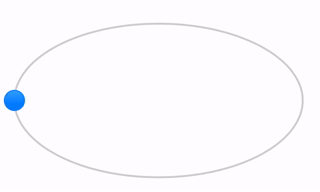
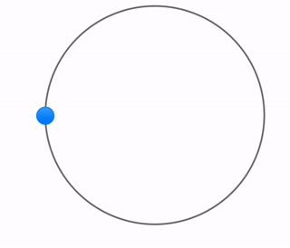
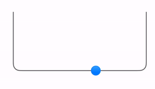

# PathSlider

<p align="center">
A SwiftUI slider component that follows any custom Path, enabling unique and engaging user interactions.
</p>

<p align="center">
  
</p>

## Usage

### Ellipse

This example uses the `Path(ellipseIn: CGRect)` initializer to quickly create a path. The View 
holds the `@State` for both the Slider's `value` and also the `pathPoint`, which is the location of the 
"thumb" indicator.

<table>
<tr>
<td width="50%" style="min-width: 400px">

```swift
import SwiftUI
import PathSlider

struct EllipseView: View {

    @State var dragPoint: CGPoint = .zero
    @State var value: Float = 0.5

    let path = Path(
        ellipseIn: CGRect(origin: .init(x: 0, y: 100),
                          size: .init(width: 300, height: 160)))

    var body: some View {
        VStack(alignment: .center) {
            PathSlider(
                path: path, 
                value: $value, 
                in: 0...1, 
                pathPoint: $dragPoint
            ) {
                Circle()
                    .stroke(.blue, lineWidth: 2.0)
                    .fill(.blue.gradient)
                    .frame(
                        width: 20, 
                        height: 20, 
                        alignment: .center
                    )
            } track: { path in
                path
                    .stroke(
                        Color.primary.opacity(0.2), 
                        lineWidth: 2
                    )
            }
        }
    }
}
```

</td>
<td>



</td>
</table>

### Using SwiftUI Shape

This example uses a SwiftUI `Shape` and the included `slider` extension method to leverage the Path provided by the Shape.
Here we render two `PathSlider` components by using a Circle and a RoundedRectangle. Note that the RoundedRectangle shape is
is modified using the `trim` method to have the open ended top.

<table>
<tr>
<td width="50%" style="min-width: 400px">

```swift
import SwiftUI
import PathSlider

struct ShapeView: View {
    @State var dragPoint: CGPoint = .zero
    @State var value: Float = 0.5

    var body: some View {
        VStack {
            Circle()
                .slider(value: $value, in: 0...1, pathPoint: $dragPoint) {
                    Circle()
                        .stroke(.blue, lineWidth: 2.0)
                        .fill(.blue.gradient)
                        .frame(width: 20, height: 20, alignment: .center)
                } track: { path in
                    path
                        .stroke(Color.black.opacity(0.6), lineWidth: 2)
                }
                .frame(maxWidth: 300, maxHeight: 280)
                .padding()

            RoundedRectangle(cornerRadius: 15)
                .trim(from: 0, to: 0.5)
                .slider(value: $value, in: 0...1) {
                    Circle()
                        .stroke(.blue, lineWidth: 2.0)
                        .fill(.blue.gradient)
                        .frame(width: 20, height: 20, alignment: .center)
                } track: { path in
                    path
                        .stroke(Color.black.opacity(0.6), lineWidth: 2)
                }
                .frame(maxWidth: 300, maxHeight: 280)
                .padding()
        }
    }
}
```

</td>
<td>




</td>
</table>


## More Examples

Included in the `Examples` directory is the `Examples.xcodeproj`. Take a look at this project to get a more interactive look at
the usage examples above. If you have any interesting examples you'd like to share, pull requests are welcome!


